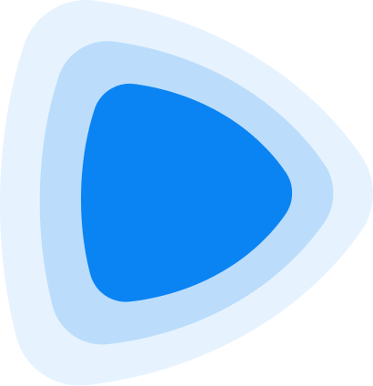

<h1 align="center">👋 Hi, I'm George (Levin) D'Souza</h1>
<h2 align="center">ಜಾರ್ಜ್ (ಲೆವಿನ್) ಡಿಸೋಜಾ</h2>

<b>ನಮಸ್ಕಾರ್! ಹಾಂವ್ ಜಾರ್ಜ್. ಮ್ಹಜ್ಯಾ ಪ್ರೊಫೈಲಾಕ್ ಸ್ವಾಗತ್!</b> 
<i>Namaskar! Hanv George. Mhajya profilak swagat!</i> (Konkani: “Hello! I'm George. Welcome to my profile!”)

<h3 align="center">Creative Technologist · Full-Stack Architect & Electro-Mechanical Technician · STEM Educator</h3>

<i>He/Him</i>

  

Eight years across **software engineering**, **multimedia production** and **STEM education**. I build custom, high-performance systems and turn complex theory into working code and practical automation.

<h2>🛠️ What I do</h2>

### ⚙️ Engineering & Automation

- Full-stack web, mobile and game development: Flutter, React, React Native, native Android and iOS, Rust, Dart, TypeScript, Python and Node.js.
- Hands-on experience operating and repairing heavy machinery, the practical base for leading teams that combine software and hardware in industrial automation.

### 🤖 AI & Infrastructure

- Run self-hosted servers and deploy local LLMs.
- Build custom agentic workflows in code, preferring hard-coded architecture over visual node-based editors.

### 🎬 Production

- Video automation pipelines built on FFmpeg and Remotion, integrated with the ElevenLabs, Gemini and OpenRouter APIs.
- 3D modelling in Blender; motion design in Rive and Adobe Creative Cloud.
- End-to-end content generation in multiple languages.

### 🧑‍🏫 Teaching

- Private tutoring in Mathematics, Physics and Programming.
- Interactive web-based physics simulators that reduce abstract concepts to practical logic.

> From architecting AI automation tools to teaching core physical sciences, my focus is on exact, practical execution.

<h2>🎓 Education</h2>

- **B.Sc.** in Physics, Chemistry and Mathematics
- **B.Ed.** with pedagogy in Physics and Mathematics

<h2>🗣️ Languages I speak</h2>

English · ಕನ್ನಡ (Kannada) · ಕೊಂಕಣಿ (Konkani) · हिन्दी (Hindi)

<h2>🤝 Connect with me</h2>

  &nbsp;
  &nbsp;
  <a href="https://x.com/GelidGeorge" target="blank">
    <picture>
      <source media="(prefers-color-scheme: dark)" srcset="assets/icons/x-dark.svg"/>
      
    </picture>
  </a>
  &nbsp;
  &nbsp;
  
  &nbsp;
  &nbsp;
  
  &nbsp;
  &nbsp;
  
   
   
  &nbsp;
  &nbsp;
  <b>Here is my <a href="mailto:souzageorgelevin@gmail.com">📫</a>, you can reach out to me.</b>

<h2>🧰 Languages and Tools</h2>
<h4>Languages</h4>

  &nbsp;&nbsp;
  &nbsp;&nbsp;
  &nbsp;&nbsp;
  <a href="https://www.rust-lang.org" target="_blank" rel="noreferrer"><picture><source media="(prefers-color-scheme: dark)" srcset="assets/icons/rust-dark.svg"/></picture></a>&nbsp;&nbsp;
  &nbsp;&nbsp;
  &nbsp;&nbsp;
  &nbsp;&nbsp;
  &nbsp;&nbsp;
  &nbsp;&nbsp;
  &nbsp;&nbsp;

<h4>Frameworks & Mobile</h4>

  &nbsp;&nbsp;
  &nbsp;&nbsp;
  &nbsp;&nbsp;
  &nbsp;&nbsp;
  <a href="https://developer.apple.com/ios/" target="_blank" rel="noreferrer"><picture><source media="(prefers-color-scheme: dark)" srcset="assets/icons/apple-dark.svg"/></picture></a>&nbsp;&nbsp;
  &nbsp;&nbsp;
  &nbsp;&nbsp;
  <a href="https://expressjs.com" target="_blank" rel="noreferrer"><picture><source media="(prefers-color-scheme: dark)" srcset="assets/icons/express-dark.svg"/></picture></a>&nbsp;&nbsp;
  &nbsp;&nbsp;
  &nbsp;&nbsp;
  &nbsp;&nbsp;

<h4>Data, Cloud & DevOps</h4>

  &nbsp;&nbsp;
  &nbsp;&nbsp;
  &nbsp;&nbsp;
  &nbsp;&nbsp;
  &nbsp;&nbsp;
  &nbsp;&nbsp;
  &nbsp;&nbsp;
  &nbsp;&nbsp;
  &nbsp;&nbsp;
  &nbsp;&nbsp;

<h4>AI & Media Automation</h4>

  &nbsp;&nbsp;
  &nbsp;&nbsp;
  &nbsp;&nbsp;
  <a href="https://elevenlabs.io" target="_blank" rel="noreferrer"><picture><source media="(prefers-color-scheme: dark)" srcset="assets/icons/elevenlabs-dark.svg"/></picture></a>&nbsp;&nbsp;
  &nbsp;&nbsp;
  &nbsp;&nbsp;

<h4>Design, Motion & 3D</h4>

  &nbsp;&nbsp;
  &nbsp;&nbsp;
  &nbsp;&nbsp;
  &nbsp;&nbsp;
  &nbsp;&nbsp;
  &nbsp;&nbsp;
  <a href="https://rive.app" target="_blank" rel="noreferrer"><picture><source media="(prefers-color-scheme: dark)" srcset="assets/icons/rive-dark.svg"/></picture></a>&nbsp;&nbsp;
  &nbsp;&nbsp;

<h4>Game Engines & Hardware</h4>

  <a href="https://unity.com/" target="_blank" rel="noreferrer"><picture><source media="(prefers-color-scheme: dark)" srcset="assets/icons/unity-dark.svg"/></picture></a>&nbsp;&nbsp;
  <a href="https://www.unrealengine.com/" target="_blank" rel="noreferrer"><picture><source media="(prefers-color-scheme: dark)" srcset="assets/icons/unrealengine-dark.svg"/></picture></a>&nbsp;&nbsp;
  &nbsp;&nbsp;

<h2>📊 GitHub stats</h2>

    

 

  
  &nbsp;
  &nbsp;
  

  
  &nbsp;
  &nbsp;
  

